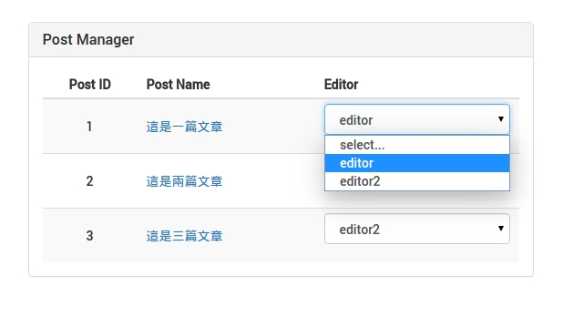

#Admin 指派 Editor
我們要再文章清單裡面在加入一個 DropDownList 可以選擇該篇文章的 Editor。

示意圖如下：




#### 修改文章清單 View
檔案路徑： `postManager/components/list.js`

在 `render()` 裡加入以下判斷是否要顯示表格 Editor 欄位
```
return ()
略...
{() => {
  if (this.state.authStatus.authority === 'admin') {
    return (
      <th>
      {this._getIntlMessage('postManager.editor')}
      </th>
      );
    }
}()}
);
```

修改 `renderPost()`，把下拉選單用 `this.renderEditor()` 方把包裝起來，方便好讀管理。
```
renderPost = (post, index) => {
    return (
      <tr className='post--row' key={index}>
        <td>
          {post.id}
        </td>
        <td>
          <Link to={`/postOne/${post.id}`} >
            {post.title}
          </Link>
        </td>
        {this.renderEdit(post)}
        {this.renderEditor(post.EditorId, post.id)}
      </tr>
    );
  }
```

`this.renderEditor()`：把使用者權限是 Editor 的顯示在下拉選單，並選擇時就立即更新到後端。
```
renderEditor(EditorId, postId) {
    if (this.state.authStatus.authority === 'admin') {
      return (
        <td>
          <Input type='select' value={EditorId} onChange={this.updateEditor.bind(this, postId)}>
            <option value='0'>select...</option>
            {this.state.editors.map(this.renderEditorsOptions)}
          </Input>
        </td>
      );
    }
  }
```
##### 程式碼說明：
* 先判斷是否為 Admin ，才可以操作選擇 Editor
* Input 寫入 onChange() 事件，當 Admin 從下拉選單選擇 Editor 時及更

設定取得 `this.state.editors` 的資料，從 role Store 取得目前所有使用者權限是 Editor。
```
state = {
    posts: this.props.flux
    .getStore('posts')
    .getState().posts,
    authStatus: this.props.flux
    .getStore('auth')
    .getState().authStatus,
    editors: this.props.flux
    .getStore('role')
    .getState().attributes
  };
```

`componentWillMount()` 加入
```
componentWillMount() {
  this.props.flux.
  getActions('role').fetchByAttributes('editor');
  }
```

`componentDidMount()` 加入
```
componentDidMount() {
  this.props.flux
  .getStore('role')
  .listen(this._handleStoreChange);
  }
```

`componentWillUnmount()` 加入
```
componentDidMount() {
  this.props.flux
    .getStore('role')
    .unlisten(this._handleStoreChange);
  }
```
修改 `_handleStoreChange()`
```
_handleStoreChange = (state) => {
  state.authStatus = this.props.flux.getStore('auth').getState().authStatus;
  state.editors = this.props.flux.getStore('role').getState().attributes;
  return this.setState(state);
}
```

`renderEditorsOptions()`：列舉 `this.state.editor` 把目前使用者權限是 Editor 顯示出來"
```
renderEditorsOptions = (editor, index) => {
    return (
      <option value={editor.id} key={index}>{editor.username}</option>
    );
  }
```

`updateEditor()`：新增 `updateEditor()` Action，做為更新文章時的觸發。
```
updateEditor = (postId, event) => {
    this.props.flux.getActions('posts').updateEditor(postId, {editorId: event.target.value});
  }
```

#### 修改 post Action
剛剛已經在 View 先定義好了 `updateEditor` Action 但還未實作，因此還需將以下程式碼加入

檔案路徑： `postManager/actions/posts.js`
```
constructor() {
  this.generateActions(
  'updateEditorSuccess'
  );
}
updateEditor(id:string, params) {
    const promise = (resolve) => {
      let that = this;
      that.alt.getActions('requests').start();
      request.put(baseUrl + 'rest/post/updateEditor/' + `${id}`)
      .send(params)
      .end((error, res) => {
        if (error) return resolve(error);
        this.actions.updateEditorSuccess(res.body.post);
        this.alt.getActions('requests').success();
        return resolve();
      }, 300);
    };
    this.alt.resolve(promise);
  }
```

#### 修改 post Store
修改 state 狀態
檔案路徑： `postManager/stores/posts.js`
```
onUpdateEditorSuccess(newPost) {
    const posts: Array<Object> = this.posts;
    posts.forEach((post, index) => {
      if (post.id === newPost.id) {
        this.posts[index] = newPost;
        // UI select default value.
        if (newPost.EditorId === null) this.posts[index].EditorId = 0;
      }
    });

    return this.setState({posts});
  }
```

完成。
