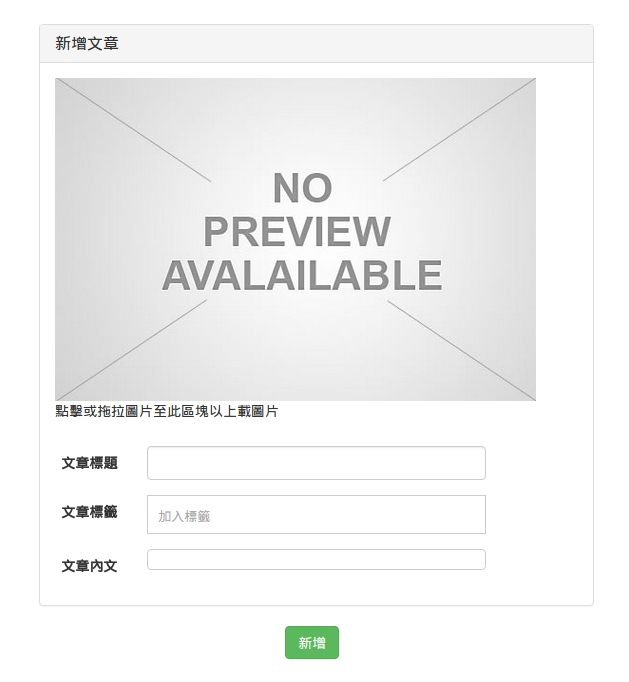

#建立文章
在文章建立這章節比較特別是，權限必須要是 Editor 才能進行文章的建立。

示意圖



#### 設定文章建立 Route
在 `app/routes.jsx` 加入此文章建立的 Route。

檔案路徑：`app/routes.jsx`
```
  {generateRoute({
    paths: ['postCreate'],
    component: require('./postManager/components/create')
  })}
```

#### 修改文章清單 View
* 加入新增文章的按鈕，並且要判斷權限是否為 Editor 才顯示。
* state 加入 authStatus 物件成員。

檔案路徑： `postManager/components/list.js`
```
state = {
    posts: this.props.flux
    .getStore('posts')
    .getState().posts,
    authStatus: this.props.flux
    .getStore('auth')
    .getState().authStatus
  };

  renderCreateBtn() {
    if (this.state.authStatus.authority === 'editor') {
      return (
        <Col md={6} mdOffset={4} sm={8} smOffset={4} xs={12}>
          <Link to={'/postCreate/'}>
            <Button bsStyle='success'>
              新增文章
            </Button>
          </Link>
        </Col>
      );
    }
  }


  render() {
    console.log(this.state);
    return (
      <Col md={6} mdOffset={3} sm={8} smOffset={4} xs={12}>
        <Panel className='app-posts'
          header={<h3>{this._getIntlMessage('postManager.title')}</h3>}>
          <Table striped responsive>
            <thead>
              <tr>
                <th>Post ID</th>
                <th>
                  {this._getIntlMessage('postManager.name')}
                </th>
              </tr>
            </thead>
            <tbody>
              {this.state.posts.map(this.renderPost)}
            </tbody>
          </Table>
        </Panel>
        {this.renderCreateBtn()}
      </Col>
    );
  }

```
##### 程式碼說明：
* 在 state 的地方加入了一個新的物件成員 authStatus
* 新增了一個方法 `renderCreateBtn()` 用來顯示出新增文章的按鈕，並且根據 `this.state.authStatus.authority` 來判斷權限

#### 上傳圖片 Component
在建立文章的時候我們有上傳圖片的功能，而上傳圖片功能不一定只會出現在 建立文章的 View 裡，因此我們可以把他獨立抽出寫成一個 Component，
在此專案下我們把常用或共用的 Component 放置在 `app/components/shared` 目錄底下。
使用相關套件：[react-dropzone(拖曳上傳圖片)](https://github.com/paramaggarwal/react-dropzone)：

檔案路徑： `app/components/shared/dropImg.jsx`
```
import React, {Component, PropTypes} from 'react';
import Dropzone from 'react-dropzone';
import {Col} from 'react-bootstrap';

let nonImage;

if (process.env.BROWSER) {
  nonImage = require('images/no-preview.png');
}

class DropImg extends Component {

  static propTypes = {
    apiUrl: PropTypes.string.isRequired,
    flux: PropTypes.object.isRequired,
    preview: PropTypes.string
  }

  onDrop(files) {
    this.props.flux.getActions('posts').uploadImg(this.props.apiUrl, files, this.props.preview);
  }

  render() {
    let img = '';
    if (this.props.preview === null || this.props.preview === '' || this.props.preview === undefined ) {
      img = nonImage;
    }
    else {
      img = '/assets/images/post/' + this.props.preview;
    }
    return (
        <Col style={{display: 'inline-block', marginBottom: '5%'}}>
          <Dropzone onDrop={this.onDrop.bind(this)} style={{width: '95%', height: '10%'}}>
            
            <div>點擊或拖拉圖片至此區塊以上載圖片</div>
          </Dropzone>
        </Col>
    );
  }

}

export default DropImg;
```
##### 程式碼說明：
* 新增了一個 Action 方法 `uploadImg()`，來處理上傳圖片

修改 `postManager/actions/posts.js` 加入 `uploadImg()`

```
constructor() {
    this.generateActions(
      'fetchSuccess', 'fetchOneSuccess', 'updateImgSuccess'
    );
  }

uploadImg(url: string, files: Array, uploadFileName: string) {
    const promise = (resolve) => {
      this.alt.getActions('requests').start();
      files.forEach((file) => {
        request.post(url)
        .attach('file', file)
        .end((err, res) => {
          if (err) return resolve(err);
          let resObj = res.body;
          uploadFileName = resObj.filename;
          this.actions.updateImgSuccess(uploadFileName);
          this.alt.getActions('requests').success();
        });
      });

      return resolve();
    };

    this.alt.resolve(promise);
  }
```
##### 程式碼說明：
使用 HTTP POST 請求並使用 `attach` 來附加圖檔，上傳成功後會回傳我們所隨機產生的圖片名稱，取得圖片名稱後我們傳遞到 Store 修改狀態，

檔案路徑： `postManager/stores/posts.js`
```
onUpdateImgSuccess(img) {
  return this.setState({img});
}
```

#### 建立文章 View
有了上傳圖片的 Component 後，接下來新增建立文章的的表單。

使用套的相關套件：
* [Alloyeditor](http://alloyeditor.com/demo/)：文章內容的編輯器

檔案路徑： `postManager/components/create.js`
```
import React, {Component, PropTypes} from 'react';
import {Button, Input, Col, Panel} from 'react-bootstrap';
import {IntlMixin} from 'react-intl';
import Alloyeditor from 'components/shared/alloyeditor';
import TagsInput from 'react-tagsinput';
import DropImg from 'components/shared/dropImg';

if (process.env.BROWSER) {
  require('react-tagsinput/react-tagsinput.css');
}

class Create extends Component {

  _getIntlMessage = IntlMixin.getIntlMessage

  static contextTypes = {
    router: PropTypes.func
  }

  static propTypes: {
    flux: PropTypes.object.isRequired
  }

  state = {
    img: this.props.flux.
    getStore('posts').img
  }

  _handleStoreChange = (state) => {
    this.setState(state);
  }

  _handleSubmit = (event) => {
    event.preventDefault();

    let newPost = {
      title: React.findDOMNode(this.refs.title.refs.input).value,
      content: React.findDOMNode(this.refs.content.refs.content).innerHTML,
      img: this.state.img,
      tags: this.refs.tags.getTags()
    };

    this.props.flux.getActions('posts').create(newPost);
    this.context.router.transitionTo('/postList');
  }


  render() {
    let body = null;

    body = (
      <div className='form-horizontal'>
        <Col md={6} mdOffset={3} sm={8} smOffset={2} xs={12}>
          <form id='edit-post-form' onSubmit={this._handleSubmit} className='app--beans'>
            <Panel className='app-posts'
              header={<h3>{this._getIntlMessage('post_create.title')}</h3>}>
              <DropImg apiUrl={'/rest/post/fileUpload/'} flux={this.props.flux} preview={this.state.img}/>
              <Input label={this._getIntlMessage('post.label_title')} labelClassName='col-xs-2' wrapperClassName='col-xs-8' type='text' ref='title' />
              <div className='form-group'>
                <label className='col-xs-2 control-label'>{this._getIntlMessage('post.label_tag')}</label>
                <div className='col-xs-8'>
                  <TagsInput ref='tags' placeholder={this._getIntlMessage('post.label_tagPlaceHolder')} />
                </div>
              </div>
              <Alloyeditor label={this._getIntlMessage('post.label_content')} labelClassName='col-xs-2' wrapperClassName='col-xs-8' ref='content' />
            </Panel>
            <Col md={6} mdOffset={5} sm={4} smOffset={3} xs={12} >
              <Button bsStyle='success' type="button" onClick={this._handleSubmit} >{this._getIntlMessage('post_create.submit')}</Button>
            </Col>
          </form>
        </Col>
      </div>
    );


    return body;
  }

}

export default Create;
```
##### 程式碼說明：
* `this._handleSubmit` 處理當表單送出之後的流程
* 建立了一個新的 create Action

#### 修改 post Action
加入 create Action

檔案路徑： `postManager/action/posts.js`
```
constructor() {
    this.generateActions(
      'fetchSuccess', 'fetchOneSuccess', 'updateImgSuccess', `createSuccess`
    );
}
create(params) {
  const promise: Function = (resolve) => {
    this.alt.getActions('requests').start();
    request.post(baseUrl + 'rest/post/')
    .send(params)
    .end((error, res) => {
      if (error) return resolve(error);
      let createdPost = res.body.post;
      this.actions.createSuccess(createdPost);
      this.alt.getActions('requests').success();
      return resolve();
      }, 300);
    };
    this.alt.resolve(promise);
}
```
##### 程式碼說明：
* 使用 HTTP POST ，把新的文章物件傳入

#### 修改 post Store
新增文章成功後，把新的文章加入到 State 裡

檔案路徑： `postManager/stores/posts.js`
```
onCreateSuccess(post) {
    const posts: Array<Object> = this.posts.slice();
    posts.push(post);
    return this.setState({posts});
  }
```

## 下一步
完成了建立文章以後，接下來實作 [修改文章](PostEditDelete.md) 。
