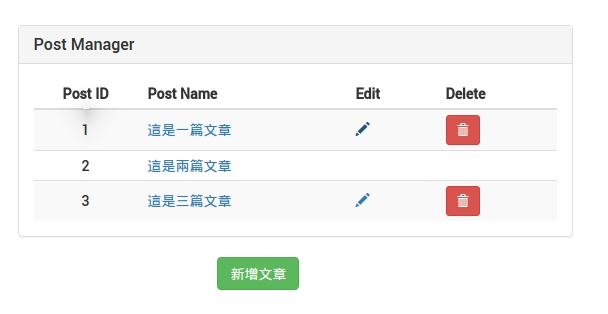

#修改，刪除文章
依照我們的需求，只有權限 Editor 才可以進行修改及刪除文章的動作。

示意圖



#### 修改 Route
在 `app/routes.jsx` 加入此文章建立的 Route。

檔案路徑：`app/routes.jsx`
```
  {generateRoute({
      paths: ['/postEdit/:id'],
      component: require('./postManager/components/edit')
  })}
```

#### 修改文章清單 View
我們要再文章清單的後方加入修改及刪除按鈕，

檔案路徑： `postManager/components/list.js`

編輯及刪除的按鈕都是重複性的，因此我們把他抽離出來
```
renderEdit(post) {
    if (this.state.authStatus.authority === 'editor') {
      let userId = this.state.authStatus.sessionUser.id;
      if (userId === post.CreatorId || userId === post.EditorId) {
        return (
          <div>
            <td>
              <Link to={`/postEdit/${post.id}`} >
                <Glyphicon glyph='pencil' />
              </Link>
            </td>
            <td>
              <Button bsStyle='danger' bsSize='small'
                onClick={this._removePost.bind(this, post.id)}>
                <Glyphicon glyph='trash'/>
              </Button>
            </td>
          </div>
        );
      } else return ( <div><td></td><td></td></div> );
    }
  }
```
##### 程式碼說明：
* `this.state.authStatus.authority === 'editor'` 判斷是 editor 才會顯示
* `userId === post.CreatorId || userId === post.EditorId` 並且再判斷是否為 Creator 或是 Editor
* `{this._removePost.bind(this, post.id)}` 刪除文章

刪除文章 `_removePost()`
```
_removePost(id) {
  this.props.flux
  .getActions('posts')
  .remove(id);
}
```
##### 程式碼說明：
* 新增一個 remove 的 Action
> 這邊我們稍候在處理編輯文章時在一起處理 remove 的 Action，我們先專注於處理 View

修改 `renderPost` ，裡頭加入 修改按鈕 `{this.renderEdit(post)}`
```
renderPost = (post, index) => {
    return (
      <tr className='post--row' key={index}>
        <td>
          {post.id}
        </td>
        <td>
          <Link to={`/postOne/${post.id}`} >
            {post.title}
          </Link>
        </td>
        {this.renderEdit(post)}
      </tr>
    );
  }
```


重複利用產生表格 th，加入 `renderTh()`，
```
renderTh(isEditorOrCreator, message) {
    if (isEditorOrCreator) {
      return (
        <th>
          {message}
        </th>
      );
    }
  }
```
##### 程式碼說明：
* 第一個參數會從 render 地方傳入判斷是否為 Creator 或是 Editor
* 第二個參數為表格名稱

修改 `render()` 加入判斷 Creator 或 Editor
```
let isEditorOrCreator = false;
let userId = this.state.authStatus.authority === '' ? 0 : this.state.authStatus.sessionUser.id;
this.state.posts.forEach((post) => {
  if (post.CreatorId === userId || post.EditorId === userId) {
    isEditorOrCreator = true;
  }
  });
```

加入判斷 `renderTh()`
```
    // 略...
                <th>
                  {this._getIntlMessage('postManager.name')}
                </th>
                {this.renderTh(isEditorOrCreator, this._getIntlMessage('postManager.edit'))}
                {this.renderTh(isEditorOrCreator, this._getIntlMessage('postManager.delete'))}
              </tr>
            </thead>
            <tbody>
              {this.state.posts.map(this.renderPost)}
            </tbody>
          </Table>
        </Panel>
        {this.renderCreateBtn()}
      </Col>
    );
  }
```


到目前為止已經把 View 的修改及刪除按鈕都建立完畢，接下來實作編輯文章 View。

#### 編輯文章 View
編輯文章的 View 與新增文章的 View 基本上是一樣的，這部份可以再把兩個 View 做合併（目前未合併）。

檔案路徑： `postManager/components/edit.js`
```
import React, {Component, PropTypes} from 'react';
import {Button, Input, Col, Panel} from 'react-bootstrap';
import {IntlMixin} from 'react-intl';
import Alloyeditor from 'components/shared/alloyeditor';
import TagsInput from 'react-tagsinput';
import DropImg from 'components/shared/dropImg';

if (process.env.BROWSER) {
  require('react-tagsinput/react-tagsinput.css');
}

class Edit extends Component {

  _getIntlMessage = IntlMixin.getIntlMessage

  static contextTypes = {
    router: PropTypes.func
  }

  static propTypes: {
    flux: React.PropTypes.object.isRequired
  }

  state = {
    post: this.props.flux
    .getActions('posts')
    .fetchOne(this.props.params.id),
    img: this.props.flux
    .getStore('posts').img
  };

  componentWillMount() {
    this.props.flux
    .getActions('posts')
    .fetchOne(this.props.params.id);
  }

  componentDidMount() {
    this.props.flux
    .getStore('posts')
    .listen(this._handleStoreChange);
  }

  _handleStoreChange = (state) => {
    this.setState(state);
  }

  _handleSubmit = (event) => {
    event.preventDefault();

    let newPost = {
      id: React.findDOMNode(this.refs.id).value,
      title: React.findDOMNode(this.refs.title.refs.input).value,
      content: React.findDOMNode(this.refs.content.refs.content).innerHTML,
      img: this.state.img,
      tags: this.refs.tags.getTags()
    };

    this.props.flux.getActions('posts').update(this.props.params.id, newPost);
    this.context.router.transitionTo('/postList');
  }

  _handleTitle = (event) => {
    let state = this.state;
    state.post.title = event.target.value;
    this.setState(state);
  }

  _handleTags = (event) => {
    let state = this.state;
    state.post.Tags = event;
    this.setState(state);
  }
  render() {
    let body = null;
    if (this.state.post !== undefined) {
      body = (
        <div className='form-horizontal'>
          <Col md={6} mdOffset={3} sm={8} smOffset={2} xs={12}>
            <form id='edit-post-form' onSubmit={this._handleSubmit} className='app--beans'>
              <Panel className='app-posts'
            header={<h3>{this._getIntlMessage('post_edit.title')}</h3>}>
                <DropImg apiUrl={'/rest/post/fileUpload/'} flux={this.props.flux} preview={this.state.img}/>
                <input type='hidden' ref='id' value={this.state.post.id}></input>
                <Input label={this._getIntlMessage('post.label_title')} labelClassName='col-xs-2' wrapperClassName='col-xs-8' type='text' ref='title' value={this.state.post.title} onChange={this._handleTitle} />
                <div className='form-group'>
                  <label className='col-xs-2 control-label'>{this._getIntlMessage('post.label_tag')}</label>
                  <div className='col-xs-8'>
                    <TagsInput ref='tags' value={this.state.post.Tags} onChange={this._handleTags} placeholder={this._getIntlMessage('post.label_tagPlaceHolder')} />
                  </div>
                </div>
                <Alloyeditor label={this._getIntlMessage('post.label_content')} labelClassName='col-xs-2' wrapperClassName='col-xs-8' content={this.state.post.content} ref='content' />
              </Panel>
              <Col md={6} mdOffset={5} sm={4} smOffset={3} xs={12} >
                <Button bsStyle='success' type="button" onClick={this._handleSubmit} >{this._getIntlMessage('post_edit.submit')}</Button>
              </Col>
            </form>
          </Col>
        </div>
      );
    }
    else {
      body = (
        <div className='app--beans'>
          <p id=''></p>
        </div>
      );
    }

    return body;
  }

}

export default Edit;
```

#### 修改 post Action
我們分別有兩個 Action 要寫：
`update()`
```
constructor() {
    this.generateActions(
      'updateSuccess'
    );
  }
update(id:string, params) {
  const promise = (resolve) => {
    let that = this;
    that.alt.getActions('requests').start();
    request.put(baseUrl + 'rest/post/' + `${id}`)
    .send(params)
    .end((error, res) => {
      if (error) return resolve(error);
      let editPost = res.body.post;
      this.actions.updateSuccess(editPost);
      this.alt.getActions('requests').success();
      return resolve();
    }, 300);
  };
  this.alt.resolve(promise);
}
```
> PS：更新使用的是 HTTP PUT

`remove()`
```
constructor() {
    this.generateActions(
      'removeSuccess'
    );
  }
remove(id: number) {
    const promise = (resolve) => {
      let that = this;
      that.alt.getActions('requests').start();

      request.del(`${baseUrl}rest/post/${id}`)
      .end(() => {
        that.actions.removeSuccess(id);
        that.alt.getActions('requests').success();
        return resolve();
      });
    };
    this.alt.resolve(promise);
  }
```
> PS：刪除使用的是 HTTP DELETE


#### 修改 post Store
有了 Action 方法後，就要去讓 Store 改變 State。

```
onUpdateSuccess(post) {
    return this.setState({post});
  }
onRemoveSuccess(id) {
  const posts: Array<Object> = this.posts.slice();
  let removeIndex = -1;
  posts.forEach((post, index) => {
    if (post.id === id) removeIndex = index;
    });

    if (removeIndex >= 0) posts.splice(removeIndex, 1);

    return this.setState({posts});
  }
```

## 下一步
完成了編輯，刪除文章以後，接下來實作 [Admin 指派 Editor](AdminSelectEditor.html) 。
