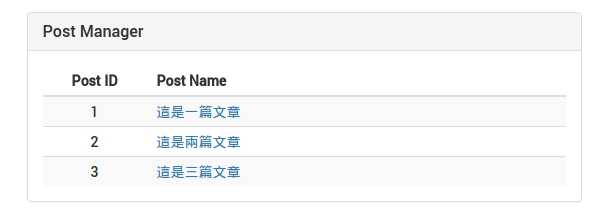

#文章清單
示意圖



#### 設定文章清單 Route
在 `app/routes.jsx` 使用我們自定義的 `generateRoute()` 方法，
path 代表網址路徑，component 則表示要 render 出來的 component。

檔案路徑：`app/routes.jsx`
```
  {generateRoute({
    paths: ['postList'],
    component: require('./postManager/components/list')
  })}
```


#### 建立文章清單 View
接下來我們可以先把 View 的基本所需要的畫面建立出來。
建立一個 `list.jsx` 檔案在 `postManager/components/` 底下，

檔案路徑： `postManager/components/list.js`

```
import React, {Component, PropTypes} from 'react';
import {Table, Panel, Col, Glyphicon, Input, Button} from 'react-bootstrap';

if (process.env.BROWSER) {
  require('postManager/styles/post.scss');
}

class Posts extends Component {

  static propTypes = {
    flux: PropTypes.object.isRequired
  }

  render() {
    return (
      <Col md={6} mdOffset={3} sm={8} smOffset={4} xs={12}>
        <Panel className='app-posts'
          header="Post Manager">
          <Table striped responsive>
            <thead>
              <tr>
                <th>Post ID</th>
                <th>
                  Post Name
                </th>
              </tr>
            </thead>
            <tbody>
              <tr className='post--row'>
                <td>1</td>
                <td>PostTitle</td>
              </tr>
            </tbody>
          </Table>
        </Panel>
      </Col>
    );
  }
}

export default Posts;
```

##### 程式碼說明：
* 在 render 裡已經建立了基本的顯示雛型，用表格來存放我的們文章清單
* 使用的樣式是 `react-bootstrap`，並且把需要用到的 Component import 進來就好。可以參考到 ES6 的 [Destructuring](http://babeljs.io/docs/learn-es2015/)

#### 多國語系設定
接下來加入多國語系，把表格的名稱替換掉
首先我們先在路徑 `app/data/` 底下的 en.js 及 fr.js 加入該語系文字檔
> PS：這邊我們先一次把全部需要使用到的語系加入，以便範例方便說明。

檔案路徑： `postManager/components/en.js`
```
postManager: {
      'page-title': 'Posts',
      title: 'Post Manager',
      name: 'Post Name',
      add: 'Add Post',
      edit: 'Edit',
      delete: 'Delete',
      editor: 'Editor',
      content: 'Post Content'
    }
```

檔案路徑： `postManager/components/fr.js`
```
postManager: {
    'page-title': 'Posts',
    title: 'Post Manager',
    name: 'post name',
    add: 'Ajouter un poste',
    edit: 'Edit',
    delete: 'Delete',
    editor: 'Editor',
    content: 'post content'
  },
```

之後回到 `postManager/components/list.js`
引用`import {IntlMixin} from 'react-intl';`
宣告`_getIntlMessage = IntlMixin.getIntlMessage`
使用`this._getIntlMessage('$name')`
```
// 略..
import {IntlMixin} from 'react-intl';
class Posts extends Component {

  _getIntlMessage = IntlMixin.getIntlMessage

  componentWillMount() {
    this.props.flux
    .getActions('page-title')
    .set(this._getIntlMessage('postManager.page-title'));
  }


  render() {
    return (
      <Col md={6} mdOffset={3} sm={8} smOffset={4} xs={12}>
        <Panel className='app-posts'
          header={<h3>{this._getIntlMessage('postManager.title')}</h3>}>
          <Table striped responsive>
            <thead>
              <tr>
                <th>Post ID</th>
                <th>
                  {this._getIntlMessage('postManager.name')}
                </th>
              </tr>
            </thead>
            <tbody>
              <tr className='post--row'>
                <td>
                  1
                </td>
                <td>
                  Title
                </td>
              </tr>
            </tbody>
          </Table>
        </Panel>
      </Col>
    );
  }
}

export default Posts;
```
這裡比較要特別說明如要更改網頁 title 可以在 [React 生命週期](https://facebook.github.io/react/docs/component-specs.html) `componentWillMount` 取得多語系檔後再修改 title ，
以上及完成多國語系的替換，接下來說明如何呼叫 API 取得文章清單，步驟如下：
* 建立 Action 方法
* 建立 Store 修改並修改 State
* 註冊 Action 及 Store
* 修改 View（讀取 State）

#### 建立 post Action
新增一個方法為 `fetch()`，並發出讀取文章清單請求，如有成功回傳則傳給 `fetchSuccess` Store 。

檔案路徑： `postManager/actions/posts.js`
```
import {baseUrl} from '../../../server/config/init';
import request from 'superagent';

class PostsActions {
  constructor() {
    this.generateActions(
      'fetchSuccess'
    );
  }
  fetch() {
    const promise: Function = (resolve) => {
      let that = this;
      that.alt.getActions('requests').start();

      // 發出請求
      request.get(baseUrl + 'rest/post')
      .end((error, res) => {

        // 錯無返回
        if (error) return resolve(error);

        // 成功時傳遞給 Store
        that.actions.fetchSuccess(res.body.posts);

        that.alt.getActions('requests').success();
        return resolve();
      });
    };
    this.alt.resolve(promise);
  }
}

export default PostsActions;
```
##### 程式碼說明：
* `request.get(baseUrl + 'rest/post')`：發出 HTTP GET 呼救後端 API，帶入參數為網址

#### 建立 post Store
檔案路徑： `postManager/actions/posts.js`

```
class PostStore {

  constructor() {
    this.bindActions(this.alt.getActions('posts'));
    this.posts = []; // 存放文章清單的陣列
  }

  // 當從 Actoin 成功取得資料後並把資料傳遞進來修改狀態
  onFetchSuccess(posts) {
    return this.setState({posts});
  }
}

export default PostStore;
```


#### 註冊 post Action 及 Store
檔案路徑： `utils/flux.js`
```
this.addActions('posts', require('postManager/actions/posts'));
this.addStore('posts', require('postManager/stores/posts'));
```

#### 修改文章清單 View（讀取 State）
檔案路徑： `postManager/components/list.js`

這邊大家應該還記得我們文章清單目前是寫死的還未從資料庫取得：
```
<tbody>
  <tr className='post--row'>
    <td>1</td>
    <td>Title</td>
  </tr>
</tbody>
```
現在要替換成從資料庫取得且文章會有非常多筆，因此我們要把這部份抽離出來。
並把原先的 tbody 內容換掉用 map 去列舉 this.state.posts 內容：
```
<tbody>
  {this.state.posts.map(this.renderPost)}
</tbody>
```

新增 `renderPost`，這邊使用 ES6 [Arrows](http://babeljs.io/docs/learn-es2015/) 會自動綁定 `this`
```
renderPost = (post, index) => {
  return (
    <tr className='post--row' key={index}>
      <td>
        {post.id}
      </td>
      <td>
        {post.title}
      </td>
    </tr>
  );
}
```

接下來就是設定：
* 在 `componentWillMount` 時觸發 `fetch()` 取得文章清單
* 在 `componentDidMount` 時設定監聽 posts 這個 store 的變化，如 store 有更改就執行自定義方法 `_handleStoreChange`
* 在 `componentWillUnmount` 時卸載監聽 posts 這個 store 的變化，釋放資源

先看以下完成程式碼，後面在說明：
```
import React, {Component, PropTypes} from 'react';
import {IntlMixin} from 'react-intl';
import {Table, Panel, Col, Glyphicon, Input, Button} from 'react-bootstrap';

if (process.env.BROWSER) {
  require('postManager/styles/post.scss');
}

class Posts extends Component {

  static propTypes = {
    flux: PropTypes.object.isRequired
  }

  _getIntlMessage = IntlMixin.getIntlMessage

  state = {
    posts: this.props.flux
    .getStore('posts')
    .getState().posts
  };

  componentWillMount() {
    this.props.flux
    .getActions('page-title')
    .set(this._getIntlMessage('postManager.page-title'));
    this.props.flux
    .getActions('posts')
    .fetch();
  }

  componentDidMount() {
    this.props.flux
    .getStore('posts')
    .listen(this._handleStoreChange);
  }

  componentWillUnmount() {
    this.props.flux
    .getStore('posts')
    .unlisten(this._handleStoreChange);
  }

  _handleStoreChange = (state) => {
    return this.setState(state);
  }

  renderPost = (post, index) => {
    return (
      <tr className='post--row' key={index}>
        <td>
          {post.id}
        </td>
        <td>
          {post.title}
        </td>
      </tr>
    );
  }

  render() {
    return (
      <Col md={6} mdOffset={3} sm={8} smOffset={4} xs={12}>
        <Panel className='app-posts'
          header={<h3>{this._getIntlMessage('postManager.title')}</h3>}>
          <Table striped responsive>
            <thead>
              <tr>
                <th>Post ID</th>
                <th>
                  {this._getIntlMessage('postManager.name')}
                </th>
              </tr>
            </thead>
            <tbody>
              {this.state.posts.map(this.renderPost)}
            </tbody>
          </Table>
        </Panel>
      </Col>
    );
  }
}

export default Posts;
```
##### 程式碼說明：
* `state = {posts: this.props.flux.getStore('posts').getState().posts}`

設定 state.posts 從 posts 的 store 取得

* `this.props.flux.getActions('posts').fetch()`

呼叫 `fetch()` Action

* `this.props.flux.getStore('posts').listen(this._handleStoreChange)`

監聽 posts store 有無任何狀態改變，如有則執行 `_handleStoreChange`


另外從以上程式碼，可以發現我們在為什麼我們在 state 去跟 store 取資料，
這跟 `componentWillMount()` 內的函式有什麼差別。

```
state = {
    posts: this.props.flux
    .getStore('posts')
    .getState().posts
  };

  componentWillMount() {
    this.props.flux
    .getActions('page-title')
    .set(this._getIntlMessage('postManager.page-title'));
    this.props.flux
    .getActions('posts')
    .fetch();
  }

```

因為 isomorphic 的關西，使用者（Client）造訪網頁的第一次都會由 server side render，
才傳給使用者（Client），因此我們要先設定好 state 的相關的狀態，
否則使用者（Client）第一次造訪網頁時會沒辦法正確取得內容資料。

另外除了第一次造訪網頁會由 server side render ，
之後使用者在操作或轉換畫面頁面都是由 Client 的 JavaScript 去渲染（render）網頁。

由 server side render 優點是：
* SEO友好 — 傳統爬蟲是不會去執行 JavaScript 的內容，雖然現在 Google 爬蟲已經可以支援，
但如果比較其次的搜尋引擎，就會沒辦法正確抓取到網頁的內容。
* 速度快 — 因為是由 server side render 好才傳給使用者（Client），因此會比先把 JavaScript 丟給 Client
在由 JavaScript 去跟 Server 取資料再渲染（render）來的快。


## 下一步
完成了文章清單以後，接下來實作當點擊文章標題時會顯示該文章的詳細內容頁 [文章瀏覽](PostSingle.html) 。
