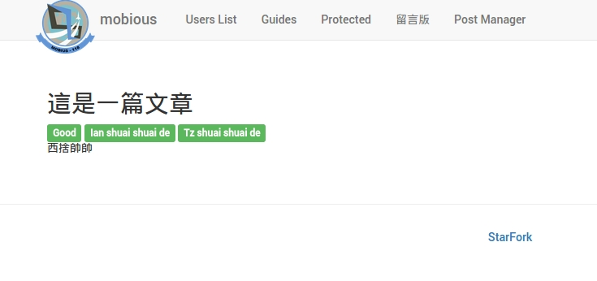

#文章瀏覽
延續前一章節的 [文章清單](PostList.html)，本章節要實作當使用者點擊文章標題以後可以瀏覽到文章的詳細內容。

示意圖



#### 設定文章瀏覽 Route
一樣在 `app/routes.jsx` 加入此文章瀏覽的 Route。

檔案路徑：`app/routes.jsx`
```
  {generateRoute({
      paths: ['/postOne/:id'],
      component: require('./postManager/components/single')
    })}
```
##### 程式碼說明：
* id 為文章的 id 唯一識別


#### 修改文章清單 View
接下來我們要再文章清單的 `文章標題` 加入超連結才能讓使用者點選。

檔案路徑： `postManager/components/list.js`
```
import {Link} from 'react-router';

renderPost = (post, index) => {
    return (
      <tr className='post--row' key={index}>
        <td>
          {post.id}
        </td>
        <td>
          <Link to={`/postOne/${post.id}`} >
            {post.title}
          </Link>
        </td>
      </tr>
    );
  }

```


#### 建立文章瀏覽 View
在 `postManager/components/` 底下建立 `single.jsx` ，
有了前一章節的經驗後，這次我們直接在建立 View 時直接先定義好取得單一文章的 Action 名稱為 `fetchOne()`。

檔案路徑： `postManager/components/single.js`
```
import React, {Component, PropTypes} from 'react';
import {IntlMixin} from 'react-intl';
import {Label} from 'react-bootstrap';

class Single extends Component {

  static propTypes = {
    flux: PropTypes.object.isRequired,
    params: PropTypes.object.isRequired
  }

  _getIntlMessage = IntlMixin.getIntlMessage

  state = {
    post: this.props.flux
    .getStore('posts')
    .getState().post
  }

  componentWillMount() {
    return this.props.flux.getActions('posts').fetchOne(this.props.params.id);
  }

  componentDidMount() {
    this.props.flux
    .getStore('posts')
    .listen(this._handleStoreChange);
  }
  componentWillUnmount() {
    this.props.flux
    .getStore('posts')
    .unlisten(this._handleStoreChange);
  }

  _handleStoreChange = (state) => {
    this.setState(state);
  }

  renderTags = (tag) => {
    return (
      <span>
        <Label bsStyle='success'>{tag}</Label>&nbsp;
        </span>
      );
  }

  render() {
    return (
      <div className='app--beans'>
        <h2>
          {this.state.post.title}
        </h2>
        {this.state.post.Tags.map(this.renderTags)}
        <div id='postContent' dangerouslySetInnerHTML={{__html: this.state.post.content }}>
        </div>
      </div>
    );
  }
}

export default Single;
```
##### 程式碼說明：
* 在 state 設定時也是從 store 去取得 post
* 定義了一個 `fetchOne()` Action 第一個參數為文章的 Id
* 另外這邊有特別使用了 React 屬性 `dangerouslySetInnerHTML` ，因為使用 React 輸出內容時會自動把內容做 HtmlEncode 把特殊字元做轉換，
如果不需要 HtmlEncode 時就要加上 `dangerouslySetInnerHTML` 屬性，此設計是 React 為了防範 [Cross-site scripting](https://en.wikipedia.org/wiki/Cross-site_scripting)，
因此要讓開發者了解到這是不安全的行為，開發者必須還要額外做過濾敏感字元。詳細可參考 [React Dangerously Set innerHTML](https://facebook.github.io/react/tips/dangerously-set-inner-html.html)

#### 修改 post Action
前一章節的 `fetch()` 請勿刪除，這邊為了排版清晰會省略顯示。

新增一個方法為 `fetchOne()`，發出取得單一文章請求，如有成功回傳則傳給 `fetchOneSuccess` Store 。

檔案路徑： `postManager/actions/posts.js`
```
constructor() {
  this.generateActions(
    'fetchSuccess', 'fetchOneSuccess'
    );
  }

// 略...

fetchOne(id: string) {
  const promise = (resolve) => {
    this.alt.getActions('requests').start();
    request.get(baseUrl + 'rest/post/' + `${id}`)
    .end((error, res) => {
      if (error) return resolve(error);
      let tagNames = res.body.post.Tags.map((tag => {
        return tag.name;
        }));
        res.body.post.Tags = tagNames.sort();
        this.actions.fetchOneSuccess(res.body.post);
        this.alt.getActions('requests').success();
        return resolve();
        });
      };

      this.alt.resolve(promise);
    }
```

#### 修改 post Store
檔案路徑： `postManager/actions/posts.js`
```
constructor() {
  this.bindActions(this.alt.getActions('posts'));
  this.posts = [];
  this.post = { Tags: []};
}

// 略...

onFetchOneSuccess(post) {
  return this.setState({post: post, img: post.img});
}
```

## 下一步
完成了文章瀏覽以後，接下來實作 [建立文章](PostCreate.html) 。
