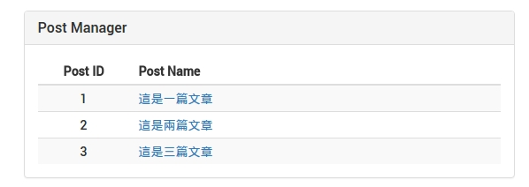
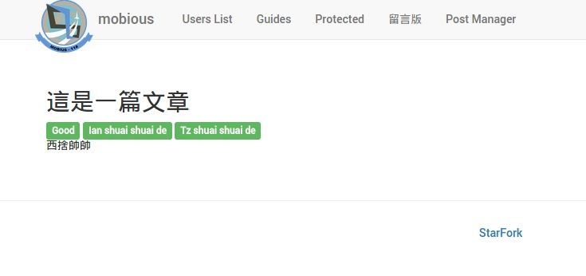
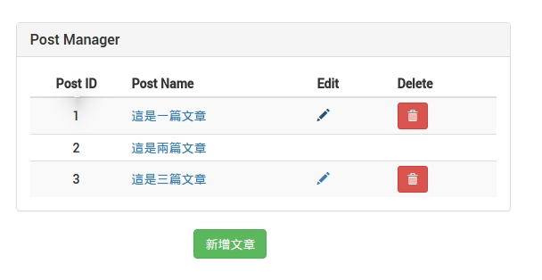
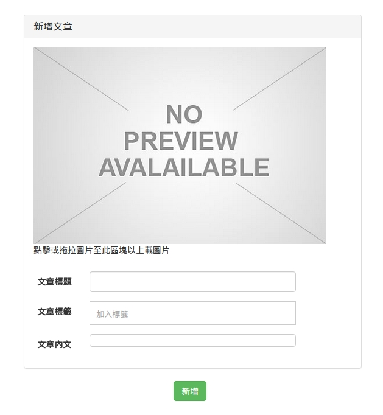

# 實作範例 ─ 以Post Manager為例

這篇實作範例我們會利用 Post Manager 功能來帶大家瞭解 Mobious 的架構流程及如何應用再實際案例上。
主要區分為前端與後端兩大部份分開說明：

##### [前端（Front-End）範例包含](Front-End.md)：
* Route — 網址路由設定
* Auth — 依照使用者權限顯可操作的功能
* View — 畫面呈現頁面、CSS套用
* Action — 註冊 Action 行為、呼叫後端 RESTful API
* Store — 處理及修改 State

##### [後端（Back-End）範例包含](Back-End.md)：
* Model（sequelize） — 定義資料表型別及設定關聯性
* Spec — 定義規格及測試
* Route — RESTful API 路由設定
* Controller — 處理邏輯層

## Post Manager 功能說明
#### 一般使用者
* 顯示文章清單
* 檢視文章內容
* 登入

#### Admin 權限
* 指定文章編輯者（Editor）

#### Editor 權限
* 新增文章
* 修改文章
* 刪除文章

## 呈現畫面
`文章清單`

`文章內容`

`登入頁面`

`指定文章編輯者（Editor）`

`Editor 文章清單檢視畫面`

`新增文章`

`修改文章`

依照我們會從後端開始寫起
